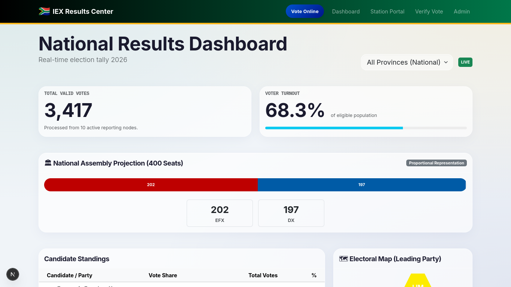

# 🇿🇦 South African Real-Time Election System MVP

A "State-of-the-Art" mocked prototype for a modern, secure, and transparent South African voting system. This project demonstrates how digital transformation can enhance the integrity and speed of elections using Next.js, real-time data aggregation, and biometric simulation.




## 🌟 Key Features

### 1. 🗳️ Hybrid Voting Model
- **Online Voting:** Secure remote voting portal (`/vote`) allowing citizens to vote from anywhere.
- **Station Kiosks:** Anti-fraud kiosk mode (`/station`) for physical voting stations, locking the device to a specific location.
- **Biometric Simulation:** Realistic face-scan animation step to verify voter identity before casting a ballot.
- **Multi-Language Support:** Full translation support for **English**, **isiZulu**, **isiXhosa**, and **Afrikaans**.

### 2. 📊 Real-Time Results Dashboard
- **Live Aggregation:** Votes are counted individually in real-time. No manual station tallying.
- **National Assembly Projection:** Dynamic calculation of the 400 Parliament seats based on current vote share.
- **Interactive Map:** Hex-grid visualization of South Africa's 9 provinces, color-coded by the leading party.
- **Voter Turnout Analytics:** Live comparison of cast votes vs. the eligible population (simulated Home Affairs DB).

### 3. 🛡️ Security & Integrity
- **Individual Vote Tracking:** Every single vote is recorded as a unique transaction, preventing station-level ballot stuffing.
- **Public Audit Ledger:** A "Matrix-style" scrolling terminal on the dashboard showing live, encrypted vote hashes (`SHA-256`) for public verification.
- **"My Vote Check":** Voters receive a unique receipt code (e.g., `A7B2-99X1`) to verify their vote on the public audit portal (`/verify`).

## 🚀 Getting Started

### Prerequisites
- Node.js 18+ installed.

### Installation
1.  Clone the repository:
    ```bash
    git clone https://github.com/maphuti-shilabje/sa-voting-mvp.git
    cd sa-voting-mvp
    ```
2.  Install dependencies:
    ```bash
    npm install
    ```
3.  Run the development server:
    ```bash
    npm run dev
    ```
4.  Open [http://localhost:3000](http://localhost:3000) in your browser.

## 🎮 How to Demo (The "Grand Finale" Script)

To experience the full capability of the system:

1.  **Start the Simulation:**
    *   Navigate to the **Admin Panel**: [http://localhost:3000/admin](http://localhost:3000/admin)
    *   Click the green **"Start Live Feed"** button. This simulates a stream of 5 votes/second coming in from across the country.

2.  **Watch the Dashboard:**
    *   Go to the **Home Page**: [http://localhost:3000](http://localhost:3000)
    *   Observe the **Total Votes** counter ticking up live.
    *   Watch the **National Assembly Seats** bar shift as parties gain/lose ground.
    *   See the **Province Map** change colors as different parties take the lead in regions like Gauteng or KZN.
    *   Check the **Audit Ledger** at the bottom for the raw stream of verified transactions.

3.  **Cast a Vote:**
    *   Go to the **Voting Portal**: [http://localhost:3000/vote](http://localhost:3000/vote)
    *   Switch the language to **isiZulu** or **Afrikaans**.
    *   Enter a mock ID (e.g., `9001015800084`).
    *   **Experience the Biometric Scan** animation.
    *   Select your province and candidate.
    *   **Save your Receipt Code** (e.g., `C3D4-E5F6`).

4.  **Verify Your Vote:**
    *   Go to [http://localhost:3000/verify](http://localhost:3000/verify).
    *   Enter your code.
    *   See the immutable record of your vote (Time, Party, Location).

## 🛠️ Tech Stack
- **Framework:** Next.js 14 (App Router)
- **Language:** TypeScript
- **Styling:** Custom Glassmorphism UI (built on Bootstrap 5)
- **Data:** Local JSON Store (Mock Database)
- **Icons/Visuals:** CSS-based animations & Hex-Grid maps

## 🇿🇦 Context
This project was designed to solve specific challenges in the South African electoral context:
*   **Long Queues:** Solved via Online Voting.
*   **Trust/Fraud:** Solved via Individual Vote Tracking & Public Ledgers.
*   **Transparency:** Solved via Real-Time Dashboards & Receipt Verification.

---
*Built for the Future of South Africa.*
